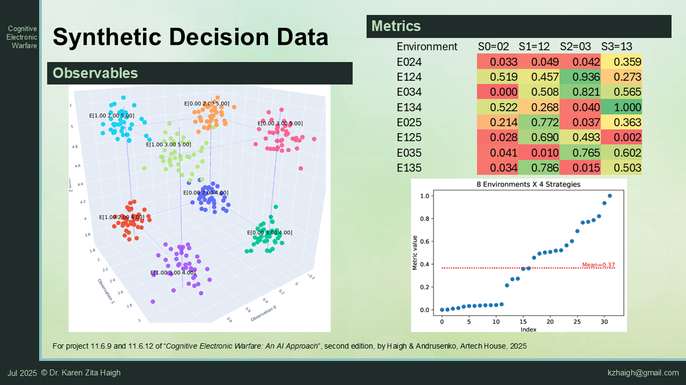

# Control-Loop for Cognitive Decision Making
A control loop that drives a cognitive decision maker.
The code is in support of the book "Cognitive EW: An AI Approach" by Karen Zita
Haigh and Julia Andrusenko. 

**runExperiment.m** 
Main entry file. It will run the vanilla versions of the scenario driver and
decision maker. It provides infrastructure for calling a more complete system

**ScenarioDriverVanilla.m** 
This code is the test infrastructure around a decision maker. It loads a
ground truth dataset, selects some of that data to be training data, runs a
"real time" test using samples from the original data (which may or may not
have been in the chosen training data). It then evaluates performance as
"Adequacy": the actual performance obtained from executing in the environment
divided by the best known (optimal) performance. 

There are several exercises for students: 
1. Configuration support for retraining in the decision maker  -- in the SD,
   it's just the boolean of whether retraining is allowed
2. Configuration support for epsilon-greedy exploration in the decision
    maker -- in the SD, it's just the value of epsilon
3. Support multiple ML regression models
4. Evaluate the models by memory and time (in addition to Adequacy)
5. Add n-choose-k ablation trials

The scenario driver corresponds to Algorithm 10.1, Figure 10.13,
and Project 11.6.12 of the second edition, or Figure 10.2 of the first edition.

**DecisionMakerVanilla.m** 
This code is a simple AI-based decision maker. It supports pretraining an ML
model on an initial dataset, then a "real time" test where it chooses a
decision for a current set of observations. The model is metric = model(
observables, controllables).

There are two student exercises: 
1. In mission learning (Update learned model with the feedback from the
  environment)
2. Epsilon-greedy exploration

The decision maker corresponds to Algorithm 5.1 (either edition),
and also Algorithm 10.1 and Project 11.6.9 of the second edition.

**PUK_kernel.m** 
A custom kernel for a support vector machine based on the approach of
Ustun, Melssen, and Buydens, "Facilitating the application of Support Vector
Regression by using a Universal Pearson VII Function Based Kernel," Chemometrics 
and Intelligent Laboratory Systems, Vol. 81, No. 1, 2006.
DOI: 10.1016/j.chemolab.2005.09.003.

**decisionData.csv** 
A synthetic dataset computing performance metrics for 8 environments, 3 observables, 
and two controllables. Here are the characteristics of this synthetic data file.

A more realistic dataset would map RF environments (e.g., threats, laydowns) to appropriate responses. For example: (i) free and clear comms, (ii) tone jammer, (iii) blinking jammer, and (iv) co-channel interference. The corresponding techniques could be (i) default operations, (ii) notch filter, (iii) redundant packets, and (iv) directional antenna
